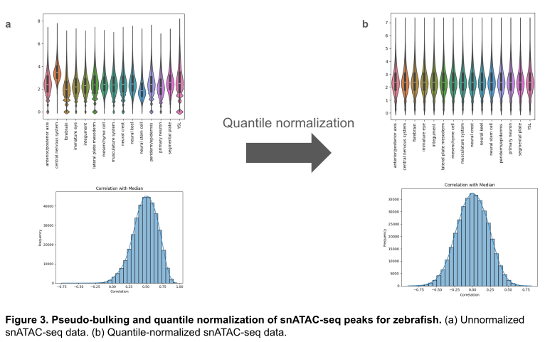
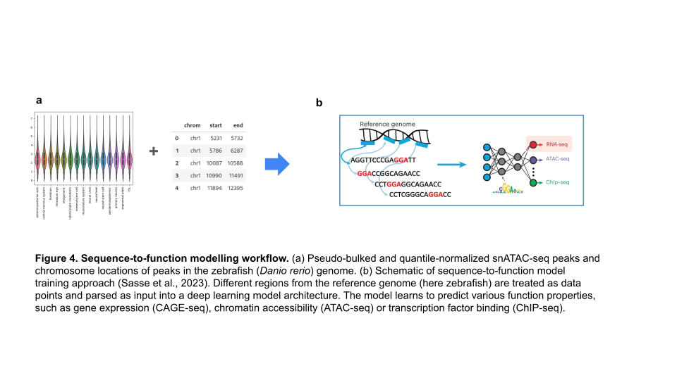
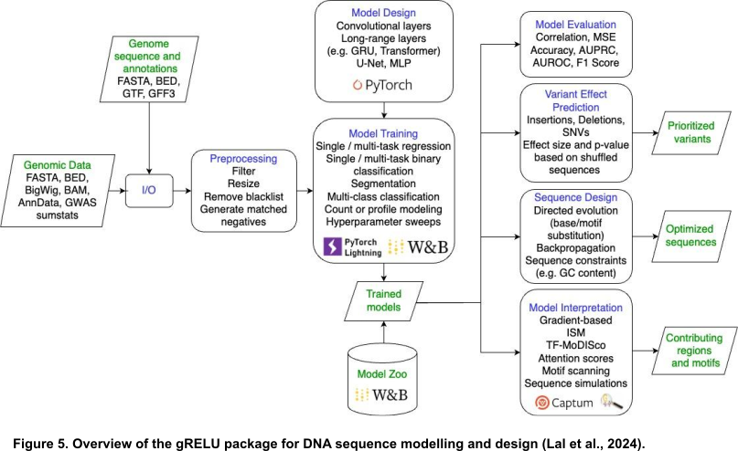
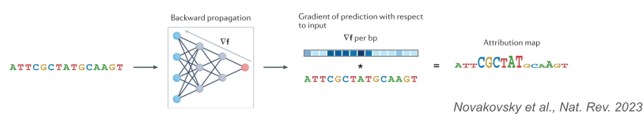
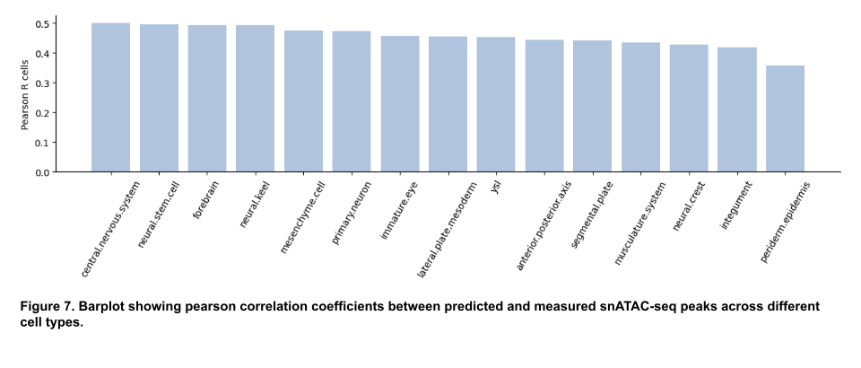
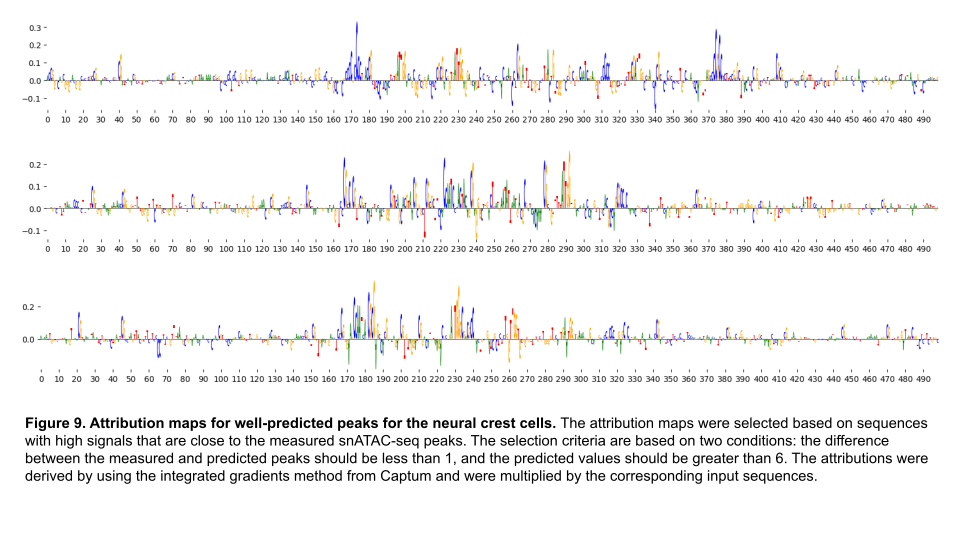
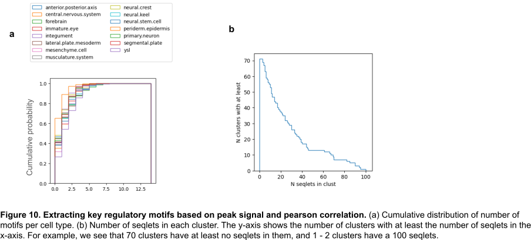
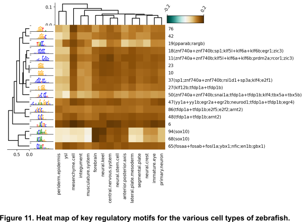

# Lab Rotation Research

## Overview

This repository contains documentation and code for my lab rotation research titled _"Understanding Cis-Regulatory Control of Neural Crest Cell Development with Deep Learning"_.

## Contents

The repository has the following key folders:

- `data/` - Datasets
- `notebooks/` - Notebooks used for data analysis
- `notes/` - Research notes
- `results/` -  Processed data outputs, graphs, and figures.
- `scripts/` - Analysis scripts
- `src/` -  Python files with modules, classes, functions that can be imported into scripts and notebooks 

## Introduction

Neural crest cells (NCCs) are transient, multipotent cells that are capable of forming diverse cell types during vertebrate embryogenesis ([Fabian et.al., 2022](https://www.nature.com/articles/s41467-021-27594-w)).  NCCs were first described in 1886 as "Zwischenstrang" (the intermediate strand) by the Swiss embryologist Wilheim His due to their location betweeen the dorsal ectoderm and the neural tube in vertebrate embryos, but were later renamed to neural crest cells by Arthur Milnes Marshall due to the more precise description of its anatomical position along the border of the neural plate during early verbrate development ([Achilleos et.al., 2012](https://www.nature.com/articles/cr201211), [Soto et.al., 2012](https://stemcellsjournals.onlinelibrary.wiley.com/doi/10.1002/sctm.20-0361)). While most authors label NCCs as stem cells, [Achilleos et.al., 2012](https://www.nature.com/articles/cr201211) states that the majority of NCCs are actually progenitor cells. Despite the semantic nuances, identifying the underlying transcription factors/regulatory motifs that are crucial for the multipotency of NCCs will lead to broadening our understanding of vertebrate development and disease. 

Recent advances in large-scale functional genomic datasets and deep learning have led to **sequence-to-function models** ([Sasse et.al., 2024](https://www.nature.com/articles/s41592-024-02331-5)). Sequence-to-function models are typically supervised machine learning approaches that utilize deep learning architectures (convolutional neural networks or transformers) to learn a mapping between DNA sequence (inputs) and functional readouts (outputs) such as chromatin accessibility, ATAC peaks, histone modification, gene expression, etc. ([Sasse et.al., 2024](https://www.nature.com/articles/s41592-024-02331-5)). Once this mapping is learnt, the models can be used to predict the impact of various genetic variations  on the gene regulation of various cell types. Furthermore, explainable AI (xAI) approaches can be applied to these models to identify key regulatory motifs that are associated with the specfic functional readouts ([Novakovsky et.al., 2023](https://www.nature.com/articles/s41576-022-00532-2)).  Therefore, the goal of this work is to ascertain if such sequence-to-function models could be used to elucidate the key transcription factors/regulatory motifs that are crucial for neural crest cells.


## Data

The main dataset used in this work is a single-nucleus assay for transposase-accessible chromatin with high throughput sequencing (snATAC-seq) dataset during zebrafish early embryogenesis ([Lin et.al., 2023](https://www.nature.com/articles/s41597-023-02373-y)). The snATAC-seq was generated at seven different time points of the first day of zebrafish embryogenesis, leading to accessibility profiles for 51,620 nuclei. The following two datasets were downloaded from the supplementary files:

- [`Cell-type Peak Matrix .rds`](https://figshare.com/ndownloader/files/40957361): an RDS file that contains peaks of rows and cell types as columns.

- [`atac_all.metaData.txt`](https://ftp.cngb.org/pub/CNSA/data4/CNP0002827/Single_Cell/CSE0000120/atac_all.metaData.txt): meta data with different features for cells.

In summary, the raw data consists of ATAC peak data for 15 cell types in 370058 chromosome locations within the zebrafish (_Danio rerio_) genome. These datasets was preprocessed using `scripts/ATAC-Seq-Analysis-Step-3-subset-celltypes.Rmd` which was originally written by Xenia Sirodzha but adapted for the purposes of this work. The preprocessed dataset consist of a pseudo-bulked matrix which contains the ATAC peaks of each cell type per chromosome location and a bed file `chromosomes.10hpf.bed` that contains the chromosomes locations of the ATAC peaks in the zebra genome. These two files were saved locally in the [data](https://github.com/sasselab/Rotation_VictorEmenike_2025-03-03/tree/main/data) folder, but due to the large file size of `psd.bulk.zfish_atac.10hpf.lg1x.csv`, it was only saved locally but not saved in this repository. Nevertheless, the user can download the raw datasets and run the aforementioned R-script to generate the processed dataset `psd.bulk.zfish_atac.10hpf.lg1x.csv`.

After pseudo-bulking, it was observed that cells in the central nervous system consistently had higher peaks than the other cell types. This could lead to increased sensitivity for these cell types after training the deep learning model. As such, the pseudo-bulked ATAC peaks were further normalized by using quantile normalization and saved as the file `normalized_peaks.csv` in the [data](https://github.com/sasselab/Rotation_VictorEmenike_2025-03-03/tree/main/data) folder. Similarly, due to large file size of `normalized_peaks.csv`, it was only saved locally and not in this repository. Nonetheless, `normalized_peaks.csv` can be generated by running the `atac_seq_analysis.ipynb` notebook in the [notebooks](https://github.com/sasselab/Rotation_VictorEmenike_2025-03-03/tree/main/notebooks) folder. 




## Methodology

### Sequence-to-function modelling with gReLU

The sequence-to-function model used is a convolutional tower followed by a Multi-head perceptron (MLP) layer architecture. This model is a multi-task model that was trained across 15 cell types in the zebrafish data by using the [gReLU](https://github.com/Genentech/gReLU) Python package developed by Genentech ([Lal et al., 2024](https://www.biorxiv.org/content/10.1101/2024.09.18.613778v1)). Before training the model, the data from converted into a `anndata` type ([Virshup et al., 2024](https://joss.theoj.org/papers/10.21105/joss.04371)). The regulatory motifs for Zebra fish (Danio Rerio) were obtained from the [`SwissRegulon Portal`](https://swissregulon.unibas.ch/data/dr11/dr11_weight_matrices) as produced by [Baranasic et al. 2022](https://doi.org/10.1038/s41588-022-01089-w).

Furthermore, the regulatory motifs (weight matrices) were converted from its original TRANSFAC 'matrix.dat' file into a MEME motif file by using the `transfac2meme` motif conversion utility from the [`The MEME Suite`](https://web.mit.edu/meme_v4.11.4/share/doc/transfac2meme.html). The final MEME file has been stored in the `data` folder as `danRer11.meme`. The training of the convolutional tower archiecture can be found in the `multi_task_model_ConvMLPModel.ipynb` Jupyter notebook in the [notebooks](https://github.com/sasselab/Rotation_VictorEmenike_2025-03-03/tree/main/notebooks) folder. All training where done in a GPU.





###  Model interpretation with integrated gradients

In order to determine the regulatory motifs, it is important to determine the feature attributions on the model. These feature attributions approaches are based on propagating pertubed data through the model and observing the effect on the model's predictions. In this work, a backward propagation method called _intergrated gradients_ was used. Integrated gradients involves calculating the gradient of the sequence-to-function model's output with respect to the input sequence by using backward propagation. Usually, the gradients obtained as multiplied by the input sequence to only focus on the nucleotides that are present in the sequence ([Novakovsky et.al., 2023](https://www.nature.com/articles/s41576-022-00532-2)). The implementation of integrated gradients used was based on the [Captum](https://captum.ai) implementation and be found in the [src/src_tools/utils.py](https://github.com/sasselab/Rotation_VictorEmenike_2025-03-03/blob/main/src/stf_tools/utils.py) file. Other feature attribution methods that could be used are forward propagation approaches such as _in silico mutagenesis_ (ISM). ISM was initially considered in this work, but it was decided against due to its high computational cost (results not shown). 



## Results

### Model performance

The model performance of the trained sequence-to-function, multi-task model can be found in Figures 7 and 8. In Figure 7, we observe that the ATAC seq peaks in the central nervous system cell type have the best Pearson correlation coefficient. Moreover, the Pearson correlation coefficient of neural crest cells is about 0.43. This indicates a moderate predictive power of the currently trained model for at least the neural crest cells. Nevertheless, this predictive power was deemed sufficient to ascertain the key motifs for the cis-regulatory control of neural crest cells.




### Sequence-to-function identifies key regulatory motifs for neural crest cells

By using the aformentioned multi-task model, attributions for the neural crest cells were generated (see Figure 9). Subsequently, these attributions for the test data set were clustered into motifs as shown in Figures 10 and 11. In Figure 11, we identify key motifs that are expressed in neural crest cells such as znf740 and sox10 ([Keuls et al., 2023](https://www.pnas.org/doi/abs/10.1073/pnas.2212578120), [Soto et.al., 2012](https://stemcellsjournals.onlinelibrary.wiley.com/doi/10.1002/sctm.20-0361)). Furthermore, motifs associated with Krüppel-like transcription factors such as klf4, klf5l, klf6a, and klf6b were identified.  Finally, motifs associated with GATA3 were also identified ([Abe at al., 2021](https://journals.biologists.com/dev/article/148/17/dev199534/272076/GATA3-is-essential-for-separating-patterning)). 







## Discussion

In this work, key regulatory motifs associated with the cis-regulatory control have been identified. These motifs are sox10, znf740 and the Krüppel-like transcription factors (klf). These results are in agreement with findings in literature. Motifs associated with the sox10 transcription factor have been shown to be expressed in neural crest cells and play a crucial role in the development and differentiation of neural crest cells ([Schock et al. 2020](https://www.frontiersin.org/journals/physiology/articles/10.3389/fphys.2020.606889/full)). Krüppel-like associated motifs have been shown to play essential roles in regulating the multipotency and formation neural crest cells ([Rigney et al., 2025](https://journals.biologists.com/dev/article/152/9/dev204634/367869)). Furthermore, GATA3 is a member of GATA family of zinc-finger transcription factors and has been found to be present in neural crest cells in the mandibular and maxillary (jaw) regions. They also play an important role in facial morphogenesis during early veterbrate embryogenesis ([Abe at al., 2021](https://journals.biologists.com/dev/article/148/17/dev199534/272076/GATA3-is-essential-for-separating-patterning)).

While the motifs were successfully found, other motifs of biological-relevance to the neural crest cells can still be identified. In this work, a convolutional tower deep learning architecture was used, but the predictive power of the model can be improved by hyperparameter optimization. Other deep learning model architectures such Enformer ([Avsec et al. 2021](https://www.nature.com/articles/s41592-021-01252-x)) which uses the transformer architecture can be explored. Asides existing model architectures, custom deep learning architectures could be implemented in gReLU and subsequently used to identify motifs. Furthermore, an agglomerative clustering method was used in this work (see `notebooks/multi_task_model_ConvMLPModel.ipynb`), but this clustering method was computational intensive when clustering more than 1000 motifs and using a very low cut-off for significance from standard deviation (say < 0.05). In this work, this was issue was solved by increasing and setting the cut-off to 0.1 (see `notebooks/multi_task_model_ConvMLPModel.ipynb`). However, a higher cut-off leads to a lower number of motifs per sequence. In a future work, a more robust clustering technique such as [Leiden clustering](https://pypi.org/project/leiden-clustering/) and a significance lower cut-off could be considered. Nevertheless, the results from this work show that sequence-to-function deep learning models could be used to understand key regulatory motifs that are connected with the cis-regultory control of neural crest cells.

## **Quick Start**
To get started with this project, do the following in the terminal:

1. **Clone the repository:**
```bash
git clone https://github.com/sasselab/Rotation_VictorEmenike_2025-03-03.git
```

2. **Navigate to the project directory:**
```bash
cd Rotation_VictorEmenike_2025-03-03
```

3. **Create a virtual environment:**

Ensure you have a Python environment set up. You can create a virtual environment (e.g. `lab_rotation`) using conda as follows:

```bash
conda create -n lab-rotation python=3.9
```

```bash
conda activate lab-rotation
```

4. **Install required packages**

```bash
pip install -e .
```

This will run the file `setup.py`, install a package called `stf_tools` that contains relevant functions used and required packages. The `stf_tools` is located in the folder `src`. 

5. **Running the pipeline**

- Navigate to the folder `notebooks`. Open the jupyter notebook `multi_task_model_ConvMLPModel.ipynb`. To train the model from scratch, set `training = True ` in the notebook.


## References

1. Achilleos, A. and Trainor, P.A., 2012. Neural crest stem cells: discovery, properties and potential for therapy. _Cell Research, 22(2)_, pp.288-304.

2. Soto, J., Ding, X., Wang, A. and Li, S., 2021. Neural crest-like stem cells for tissue regeneration. _Stem Cells Translational Medicine, 10(5)_, pp.681-693.

3. Fabian, P., Tseng, K.C., Thiruppathy, M., Arata, C., Chen, H.J., Smeeton, J., Nelson, N. and Crump, J.G., 2022. Lifelong single-cell profiling of cranial neural crest diversification in zebrafish. _Nature Communications, 13(1)_, p.13.

4. Sasse, A., Chikina, M. and Mostafavi, S., 2024. Unlocking gene regulation with sequence-to-function models. _Nature methods, 21(8)_, pp.1374-1377.

5. Novakovsky, G., Dexter, N., Libbrecht, M.W., Wasserman, W.W. and Mostafavi, S., 2023. Obtaining genetics insights from deep learning via explainable artificial intelligence. _Nature Reviews Genetics, 24(2)_, pp.125-137.

6. Lin, X., Yang, X., Chen, C., Ma, W., Wang, Y., Li, X., Zhao, K., Deng, Q., Feng, W., Ma, Y. and Wang, H., 2023. Single-nucleus chromatin landscapes during zebrafish early embryogenesis. _Scientific Data, 10(1)_, p.464.

7. Sasse, A., Ng, B., Spiro, A.E., Tasaki, S., Bennett, D.A., Gaiteri, C., De Jager, P.L., Chikina, M. and Mostafavi, S., 2023. Benchmarking of deep neural networks for predicting personal gene expression from DNA sequence highlights shortcomings. _Nature Genetics, 55(12)_, pp.2060-2064.

8. Lal, A., Gunsalus, L., Nair, S., Biancalani, T. and Eraslan, G., 2024. gReLU: A comprehensive framework for DNA sequence modeling and design. _bioRxiv_, pp.2024-09.

9. Virshup, I., Rybakov, S., Theis, F.J., Angerer, P. and Wolf, F.A., 2024. anndata: Access and store annotated data matrices. _Journal of Open Source Software, 9(101)_, p.4371.

10. Baranasic, D., Hörtenhuber, M., Balwierz, P.J., Zehnder, T., Mukarram, A.K., Nepal, C., Várnai, C., Hadzhiev, Y., Jimenez-Gonzalez, A., Li, N. and Wragg, J., 2022. Multiomic atlas with functional stratification and developmental dynamics of zebrafish cis-regulatory elements. _Nature Genetics, 54(7)_, pp.1037-1050.

11. Keuls, R.A., Oh, Y.S., Patel, I. and Parchem, R.J., 2023. Post-transcriptional regulation in cranial neural crest cells expands developmental potential. _Proceedings of the National Academy of Sciences, 120(6)_, p.e2212578120.

12. Rigney, S., York, J.R. and LaBonne, C., 2025. Krüppel-like factors play essential roles in regulating pluripotency and the formation of neural crest stem cells. _Development, 152(9)_, p.dev204634.

13. Abe, M., Cox, T.C., Firulli, A.B., Kanai, S.M., Dahlka, J., Lim, K.C., Engel, J.D. and Clouthier, D.E., 2021. GATA3 is essential for separating patterning domains during facial morphogenesis. _Development, 148(17)_, p.dev199534.

14. Schock, E.N. and LaBonne, C., 2020. Sorting sox: diverse roles for sox transcription factors during neural crest and craniofacial development. _Frontiers in Physiology, 11_, p.606889.

15. Avsec, Ž., Agarwal, V., Visentin, D., Ledsam, J.R., Grabska-Barwinska, A., Taylor, K.R., Assael, Y., Jumper, J., Kohli, P. and Kelley, D.R., 2021. Effective gene expression prediction from sequence by integrating long-range interactions. _Nature Methods, 18(10)_, pp.1196-1203.